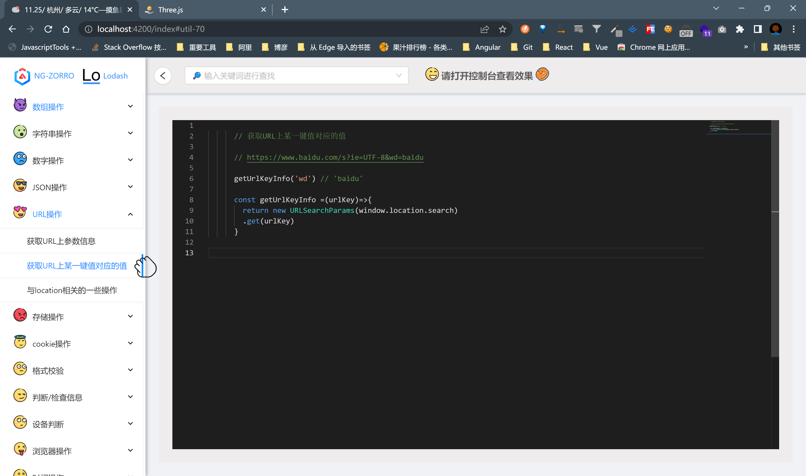
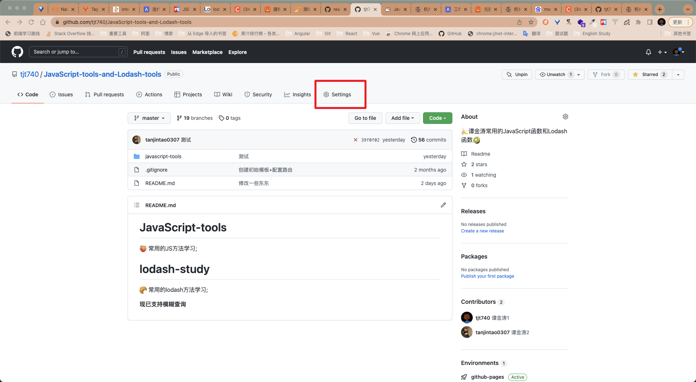
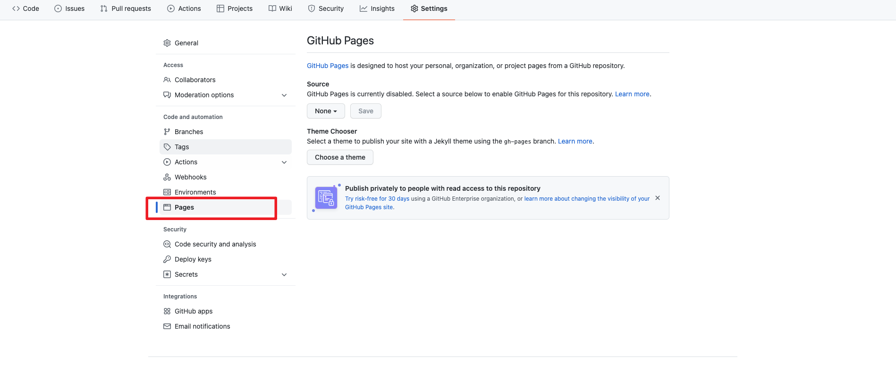
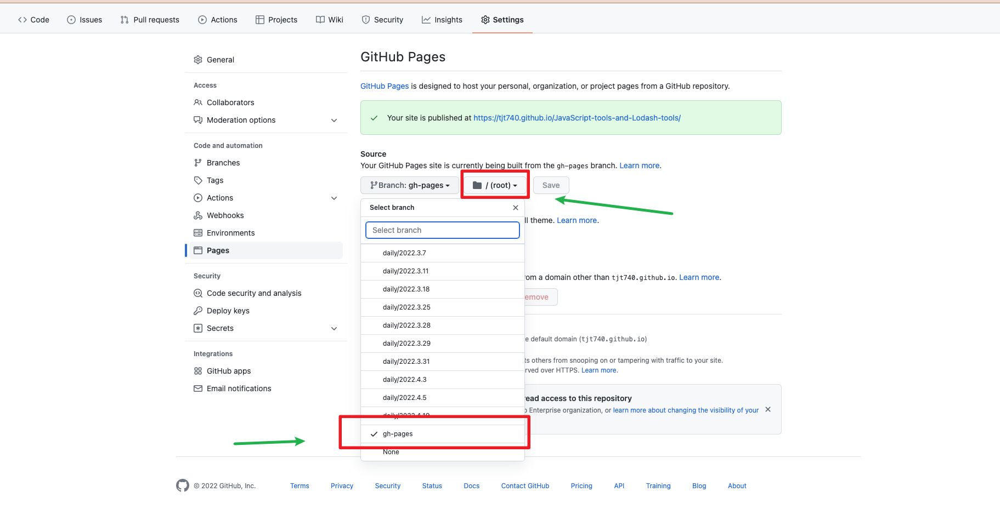
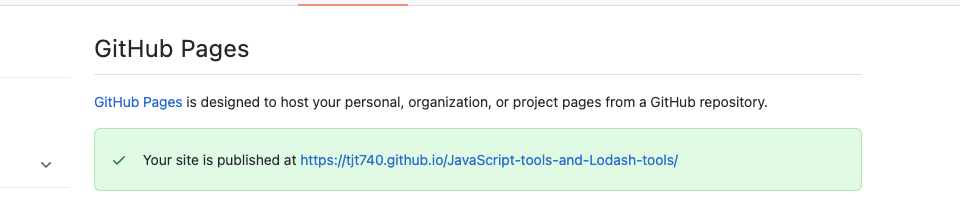

# 此项目是一些常用的JS函数 + Lodash方法的汇总

🍑


- 🥐 现已支持模糊查询
- 🍊 富文本编辑用的Monaco Editor编辑器
- 🥑 Angular-cli v13.2.3
- 🚶 不定时更新...
  
# 如何将项目部署到Github Pages上

1. cd进入仓库里创建的angular项目

```
 gongdao@gongdaodeMacBook-Pro JavaScript-tool-function % cd javascript-tools
```
  
2. 在angular项目里安装ghpages插件

```
 ng add angular-cli-ghpages
```

3. 构建部署（deploy）

```
 ng deploy --base-href=https://[用户名].github.io/[仓库名（不是项目名）]/ 

 ng deploy --base-href=https://tjt740.github.io/JavaScript-tools-and-Lodash-tools/ 
```

4. 在Github中的 *Settings* 中的选择 *Pages*



5. 选择 *gh-pages* 分支，*/root*，然后Save


6. 点击链接【完成】
​​

**PS: 最好每次都把新创建的分支合到master上再部署到Github Pages**

>简化【打包+发布】命令

`在package.json文件中添加:`

```
 "github:ghpages":"ng deploy --base-href=https://tjt740.github.io/JavaScript-tools-and-Lodash-tools/"
```

`在项目中执行简化后的【打包+发布】命令`

```
  npm run github:ghpages
```
